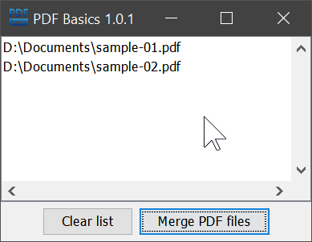

# PDF Basics #

This is a portable free PDF tool for Windows.

It allows you to compile a list of PDF files via drag and drop and merge it into a single file.

## Setup ##

* Download [pdfbasics-1.0-win-64.zip](https://github.com/JensPiegsa/pdfbasics/releases/download/1.0/pdfbasics-1.0-win-64.zip) (30MB)
* Unzip the archive locally
* Run `pdfbasics.exe`

## Usage ##

1. Drag and drop PDF files from a file browser to the application window of PDF Basics.
2. Click *Merge PDF files* and wait until a final dialog message pops up.
3. The resulting file is stored in your home directory and is named `merged_TIMESTAMP.pdf`.

## Screenshot ##

